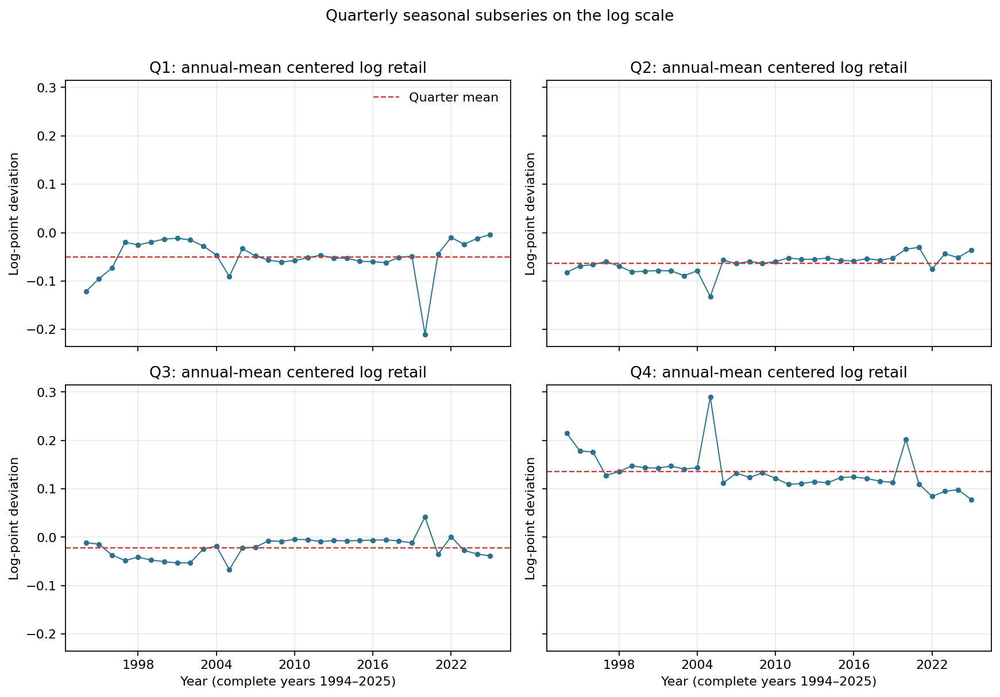
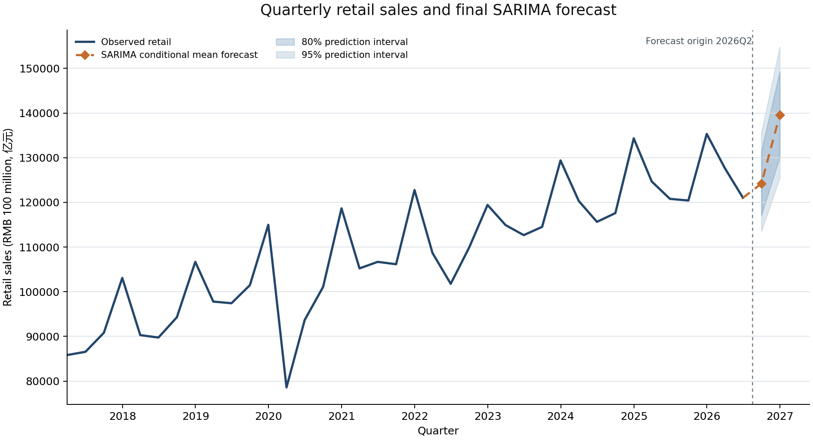

# Forecasting Quarterly Retail Sales in China

**Course**: STA4003 Time Series Project

**Report**: Final forecast and research report

**Data through**: 2026Q2

**Forecast origin**: 2026Q2

**Report date**: 2026-10-03

<!-- PAGE_BREAK -->

## 1 Abstract

This project evaluates whether Lunar New Year timing adds out-of-sample forecasting value beyond quarterly time-series structure in China's retail sales. Under the prespecified rolling-origin protocol, the frozen seasonal ARIMA baseline is strong: its h=2 all-target errors are lower than the three simple benchmarks and the fixed ETS comparator. SARIMA+CNY has only very small and mixed improvements, and its MAE and MASE advantages disappear when the 2 preset shock targets are excluded. The fixed lag-2 PMI extension performs worse than its common SARIMA reference on all three h=2 metrics in its separate secondary window. A parsimonious plain SARIMA is therefore retained for the final forecast. It is refit on all 130 observed quarters from 1994Q1 through 2026Q2, then forecasts 2026Q3 and 2026Q4 from origin 2026Q2.

## 2 Research Question

The research question is whether deterministic information about Lunar New Year timing improves quarterly retail-sales forecasts beyond standard seasonal time-series dynamics. Forecast comparisons use the information available at each chronological origin. Coefficients and forecast differences are predictive descriptions under the specified models; they do not identify causal effects.

## 3 Data

The canonical sample contains 130 quarterly observations from 1994Q1 through 2026Q2. Retail sales are national aggregate amounts from the archived National Bureau of Statistics series and remain in RMB 100 million (亿元). The response used for model fitting is the natural logarithm of this level. The manufacturing PMI has 86 quarterly observations from 2005Q1 through 2026Q2; its later forecasting test is kept on a shorter, explicitly separate window.

## 4 Data Construction

The quarterly retail series is constructed from monthly source data. For 1994-1999, quarterly values are sums of the available current-period monthly observations. From 2000 onward, quarterly values are differences of the cumulative series, which telescope to the December cumulative amount by construction. No economic values are imputed. The CNY date and position fraction are deterministic calendar metadata; the Stage 5 regressor uses only a training-centered Q1 fraction. PMI is aggregated as the arithmetic mean of its three monthly observations, then lagged before the Stage 6A evaluation.

An early descriptive diagnostic compares February retail with January retail. It is a February-to-January ratio, not February's share of combined January-February retail. The source-vintage differences and expected reporting gaps are documented in the Stage 1 data audit.

## 5 Exploratory Analysis and Stationarity

Retail sales rise strongly over the sample, while the logarithm makes proportional changes easier to compare and reduces the scale growth. The log transform does not itself establish stationarity. Across 32 complete years, Q4 was above its annual mean in 32 years; Q1 was below its annual mean in 32 years and Q2 in 32 years. These are descriptive within-year patterns, not a separate seasonal forecasting model.

*Figure 1. Annual-mean-centered log retail by quarter, showing the quarterly seasonal pattern. Source: Stage 2 frozen output.*

The prespecified ADF and KPSS tests on log levels point to non-stationarity under their stated deterministic terms (ADF p=0.995; KPSS probability is reported at its lower table bound). The first-difference tests are inconclusive at 5% (ADF p=0.295; KPSS p=0.071). Stage 2 treated regular differencing as a cautious starting point and did not establish seasonal differencing. In Stage 4, rolling AICc selection chose D=1 at 0 of 87 origins, consistent with retaining D=0 in the dominant orders. Full test details are in `outputs/tables/stationarity_tests.csv` and `outputs/tables/sarima_origin_selection.csv`.

## 6 Forecast Evaluation Design

The primary rolling evaluation uses the common 2005Q1-2026Q2 target window and expanding training samples beginning in 1994Q1. For each target, the forecast origin is the target quarter minus the horizon. The primary endpoint is h=2 across all targets; h=1 is secondary, and Q1 is a prespecified subgroup. All models use the same original retail-level errors and origin-specific, training-only seasonal period-4 MASE scales. Lower MAE, RMSE, and MASE indicate lower errors.

The Stage 6A PMI extension uses its own secondary 2010Q4-2026Q2 target window because complete lag-2 PMI coverage starts later. Its SARIMA-common reference is refit on the same restricted training sample as SARIMA+PMI. The resulting sample is not combined with or substituted for the 86-target primary window.

## 7 SARIMA Baseline

Stage 4 selected orders separately at each rolling origin using only that origin's training sample and AICc. The fixed candidate family had 46 candidates, and the chosen full-sample descriptive order was SARIMA(0,1,1)(1,0,1)[4]. The rolling evaluation did not use out-of-sample errors to choose an order. The final fit below is a new fit of that already frozen full-sample order.

At h=2 across all primary-window targets, SARIMA had MAE 2,970.24, RMSE 5,115.52, and MASE 0.947893. It beat each simple benchmark on all three metrics. The fixed ETS comparator also beat the simple benchmarks, but its h=2 all-target MAE, RMSE, and MASE were higher than SARIMA's.

*Table 1. Primary-window h=2 performance. MAE and RMSE are in 亿元; MASE is unit-free. Source: frozen Stage 3-6B metric tables.*

| Model | N | MAE | RMSE | MASE |
| --- | --- | --- | --- | --- |
| Historical Mean | 86 | 47,701.43 | 53,655.68 | 14.752580 |
| Naive | 86 | 6,914.05 | 9,376.89 | 2.203949 |
| Seasonal Naive | 86 | 5,991.50 | 7,023.89 | 2.246349 |
| SARIMA | 86 | 2,970.24 | 5,115.52 | 0.947893 |
| SARIMA+CNY | 86 | 2,965.73 | 5,021.59 | 0.946407 |
| ETS | 86 | 3,242.32 | 5,211.84 | 1.059760 |

## 8 Lunar New Year Incremental Value

Stage 5 adds one Q1-only, training-centered CNY timing regressor to the order selected by Stage 4 at each origin. On the primary h=2 all-target endpoint, the changes for SARIMA+CNY minus SARIMA were MAE -4.51, RMSE -93.93, and MASE -0.001486. The absolute reductions are small. In the 22-target Q1 subgroup, MAE changes by +28.93, RMSE by -114.55, and MASE by -0.000046; the subgroup metrics are mixed.

*Table 2. CNY minus SARIMA loss changes; negative values favor SARIMA+CNY.*

| Comparison | N | Change in MAE | Change in RMSE | Change in MASE |
| --- | --- | --- | --- | --- |
| CNY minus SARIMA; h=2 all | 86 | -4.51 | -93.93 | -0.001486 |
| CNY minus SARIMA; h=2 Q1 | 22 | +28.93 | -114.55 | -0.000046 |

The separate full-sample CNY coefficient and AICc are descriptive fit statistics, not evidence of out-of-sample forecasting value. The fixed-protocol result does not support a material or consistently positive incremental forecasting improvement. It describes forecast accuracy under the tested quarterly specification and does not identify a causal calendar effect.

## 9 PMI Extension

Stage 6A tests only lag-2 quarterly PMI, centered at 50, so both forecast-horizon inputs are available at the origin. Across 63 h=2 all-target observations in the secondary window, the SARIMA+PMI model has higher MAE by 1.51%, higher RMSE by 0.35%, and higher MASE by 1.54% than SARIMA-common. The extension therefore does not improve this secondary endpoint.

*Table 3. Stage 6A h=2 all-target results on the separate secondary window.*

| Model | N | MAE | RMSE | MASE |
| --- | --- | --- | --- | --- |
| SARIMA-common | 63 | 3,459.96 | 5,906.20 | 0.549654 |
| SARIMA+PMI | 63 | 3,512.17 | 5,926.59 | 0.558122 |

## 10 ETS and Shock Robustness

Stage 6B adds only the fixed additive-error, damped-additive-trend, additive-seasonality ETS specification with period 4. Its primary-window h=2 metrics are worse than SARIMA but better than the three simple benchmarks. The sensitivity analysis changes only the scored target rows for the preset quarters 2020Q1 and 2022Q2; it does not delete training observations or refit models.

*Table 4. SARIMA+CNY minus SARIMA changes before and after excluding the preset shock targets.*

| Score sample | N | Change in MAE | Change in RMSE | Change in MASE |
| --- | --- | --- | --- | --- |
| All preset targets | 86 | -4.51 | -93.93 | -0.001486 |
| Exclude 2020Q1 and 2022Q2 | 84 | +2.05 | -86.87 | +0.000104 |

With both targets retained, CNY has a very small reduction on each aggregate metric. After excluding them, its MAE and MASE changes become small increases while the RMSE change remains a reduction. The interpretation remains mixed, and the shock-excluded aggregation does not replace the primary endpoint.

## 11 Final Forecast for 2026Q3 and 2026Q4

The final primary forecaster is the plain SARIMA(0,1,1)(1,0,1)[4], refit on 1994Q1-2026Q2 (130 observations) and forecast from origin 2026Q2. It contains no CNY or PMI exogenous variables and uses no observations after 2026Q2. The conditional-mean point forecast is exp(mu + 0.5 v). Prediction intervals use exp(mu plus or minus the normal quantile times sqrt(v)); the 0.5 v adjustment is not applied to interval quantiles. The intervals represent forecast-distribution uncertainty conditional on fitted parameters and do not include parameter-estimation uncertainty.

*Figure 2. Observed retail through 2026Q2 and the h=1/h=2 primary forecast. Amounts are in RMB 100 million (亿元).*

*Table 5. Final primary forecasts from origin 2026Q2. Values and intervals are in 亿元.*

| Target | Horizon | Median | Conditional mean point forecast | 80% prediction interval | 95% prediction interval |
| --- | --- | --- | --- | --- | --- |
| 2026Q3 | h=1 | 124,051.91 | 124,179.57 | [117,046.90, 131,476.15] | [113,500.24, 135,584.52] |
| 2026Q4 | h=2 | 139,361.23 | 139,562.26 | [130,094.24, 149,288.33] | [125,440.70, 154,826.56] |

The supplementary comparison refits SARIMA+CNY with the Stage 5 CNY definition and uses the Stage 6B fixed ETS specification. The Q3 and Q4 CNY regressors equal zero because both targets are outside Q1. These forecasts are supplementary; they are not ensembled and do not determine the primary model.

*Table 6. Supplementary level forecasts; they do not alter the primary choice.*

| Model | 2026Q3 forecast | 2026Q4 forecast | Forecast convention |
| --- | --- | --- | --- |
| SARIMA | 124,179.57 | 139,562.26 | exp(log mean + 0.5 * log forecast variance) |
| SARIMA+CNY | 123,542.83 | 138,822.30 | exp(log mean + 0.5 * log forecast variance); future regressor is zero |
| ETS | 125,265.66 | 141,597.81 | exp(log forecast) * mean(exp(training residuals)) |

The final full-sample fit converged (True) with AIC -415.864, AICc -415.544, and lag-8 Ljung-Box p-value 0.759. The complete parameter and residual diagnostics are retained in `outputs/tables/final_model_diagnostics.csv`.

## 12 Limitations

The quarterly sample is modest and covers multiple growth regimes and unusual periods. Retail sales are nominal; these forecasts do not estimate real consumption growth. The lognormal intervals condition on fitted model parameters, and model-order uncertainty is not included. The CNY analysis tests one prespecified encoding and has limited Q1 targets; PMI uses one lag and a shorter secondary window without historical release-vintage adjustment. Shock sensitivity covers two prespecified target quarters only. None of these analyses establishes causality or guarantees forecast accuracy beyond the stated sample and model definitions.

## 13 Conclusion

Quarterly seasonality and a strong SARIMA baseline explain the main forecasting result under the frozen evaluation protocol. CNY timing does not show material and consistently positive out-of-sample improvement beyond that baseline, the fixed lag-2 PMI extension does not improve its separate h=2 comparison window, and fixed ETS remains behind SARIMA on the primary endpoint. The final forecasts therefore use the parsimonious Stage 4 full-sample SARIMA order, with the origin, training sample, point forecast, and prediction intervals reported explicitly above.

## 14 Reproducibility and Traceability

The forecast and report can be rebuilt with `python scripts/modeling/final_forecast.py` and `python scripts/reporting/build_final_report.py`. Run the repository test suite with `pytest -q` and compile the Python sources with `python -m compileall scripts tests`. Core numeric sources are `outputs/diagnostics/stage2_summary.json`, the Stage 3-6B tables under `outputs/tables/`, `outputs/forecasts/final_forecast.csv`, and `outputs/tables/final_model_diagnostics.csv`. The file `docs/stage7_protected_artifact_sha256.json` records the hashes used to verify that Stage 0-6B data and outputs remain unchanged.
