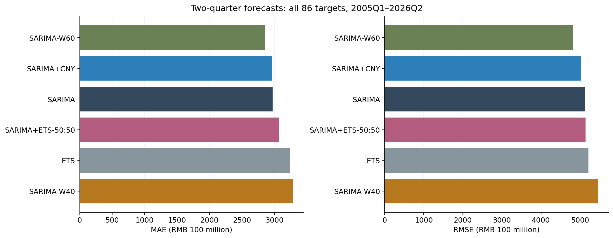

# 优化研究第一轮：60 季度窗口是待验证候选

研究日期：2026-10-08。数据截至 2026Q2。本轮为用户授权的独立研究分支；原 Stage 1–7 的数据、预测、报告和 proposal 保持不变。

## 主要结果

174/174 个窗口拟合成功，每个窗口覆盖原来的两个步长、各 86 个目标。模型沿用每个起点已有的 SARIMA 阶数，使用原归档 MASE 分母。主要评价仍为 h=2、2005Q1–2026Q2 的全部目标。

| 模型 | MAE（亿元） | RMSE（亿元） | MASE |
|---|---:|---:|---:|
| 原 SARIMA | 2,970.24 | 5,115.52 | 0.947893 |
| SARIMA+CNY | 2,965.73 | 5,021.59 | 0.946407 |
| SARIMA-W40 | 3,285.01 | 5,454.58 | 1.041085 |
| SARIMA-W60 | 2,848.79 | 4,811.08 | 0.930755 |
| SARIMA/ETS 等权组合 | 3,072.33 | 5,136.95 | 0.993093 |

W60 相对原 SARIMA 的 MAE 下降约 **4.09%**、RMSE 下降约 **5.95%**、MASE 下降约 **1.81%**。W40 和等权组合均没有改善主要指标。



## 为什么还不能替换主模型

W60 减原 SARIMA 的主要配对区块 bootstrap 95% 描述性区间：

| 指标差 | 点估计 | 95% 区间，block=4 |
|---|---:|---:|
| MAE（亿元） | -121.44 | [-548.11, 154.19] |
| RMSE（亿元） | -304.45 | [-947.98, 115.09] |
| MASE | -0.017138 | [-0.123162, 0.054174] |

block=8 的敏感性区间也跨零。这些区间基于已拟合历史流程，不包含规格搜索的不确定性，也不是独立未来验证或多重比较校正后的显著性结论。

分期表中，W60 的 MAE 在 2005–2011、2012–2019 高于基线，在 2020–2026 低于基线（5,898.41 对 6,700.38 亿元）。改善集中在近期，不能解读为短窗口普遍优于长期样本。

仅剔除原 Stage 6B 已预设的两个评分目标 2020Q1、2022Q2 后，W60 的 MAE/RMSE 为 2,503.57/3,804.61 亿元，原 SARIMA 为 2,634.72/4,218.66 亿元。点估计优势没有完全依赖这两个季度，但该 84 目标分析仍为补充结果，不替代主要评价。

## 其他实验得到的证据

- **春节变量：**主要 MAE 差为 -4.51 亿元，其描述性区间为 [-122.48, 109.25]；本轮没有增强“春节日期稳定提高季度预测”的证据。
- **区间评价：**原 SARIMA 的名义 95% 两季度参数区间实际覆盖率为 90.70%。测试的简单误差尺度校准覆盖率为 89.53%，Winkler 分数由 33,912.34 增至 44,720.67；区间代价变差，未采用该校准。W60 参数区间覆盖率为 91.86%，仍低于名义 95%。
- **均值/中位数：**两种点预测分别评分，未重写原条件均值成绩；全部结果见 `point_metrics.csv`。
- **日历聚合：**春节前 14 天至后 7 天的窗口，在 33 个年份里全部落在 Q1，季度分配变量没有年际变化。春节前 30 天至后 7 天存在前一年 Q4 的分配变化，但本轮仅检查日历构造，没有证明实际消费影响或预测价值。
- **完整性：**逐起点 checkpoint 可续跑；174 个拟合中，W40 的 2012Q2 使用一次终端参数续跑，W60 的 2004Q3 使用确定性起点重试。没有预测替代或漏掉失败起点。

## 证据边界与下一步

新规格是在看过原成绩后提出的，历史数据也没有按发布日期重建版本，结果属于探索性的伪实时比较。本轮不自动改变主模型、不生成新的最终预测。

后续最有价值的检验是：冻结 W60 规格，使用之后未查看的季度做顺序验证；若进一步比较窗口或阶数，应在各起点训练期内选择并保留外层评价。区间方面应先诊断漏覆盖集中的季度与尾部误差，再提出新的校准方案。春节研究可以进一步检验月度聚合机制，但不能任意拆分 2012 年后的一二月联合数据。

## 复现与完整产物

- [实验协议](optimization_protocol.md)
- [完整中文报告](../outputs/optimization/round1/research_report.md)
- [原始窗口预测](../outputs/optimization/round1/window_forecasts.csv)
- [拟合与重试记录](../outputs/optimization/round1/window_fits.csv)
- [全部配对不确定性结果](../outputs/optimization/round1/paired_bootstrap.csv)
- [区间评价](../outputs/optimization/round1/interval_metrics.csv)
- [运行环境及原归档保留检查](../outputs/optimization/round1/execution.json)

```powershell
python scripts/optimization/run_research.py
python scripts/optimization/run_research.py --analysis-only
python -m pytest -q
python -m compileall scripts tests
```

成功 checkpoint 默认复用，失败 checkpoint 仅在显式 `--retry-failed` 时重试。跨环境数值逐字节一致不作保证；原归档保持不变。
