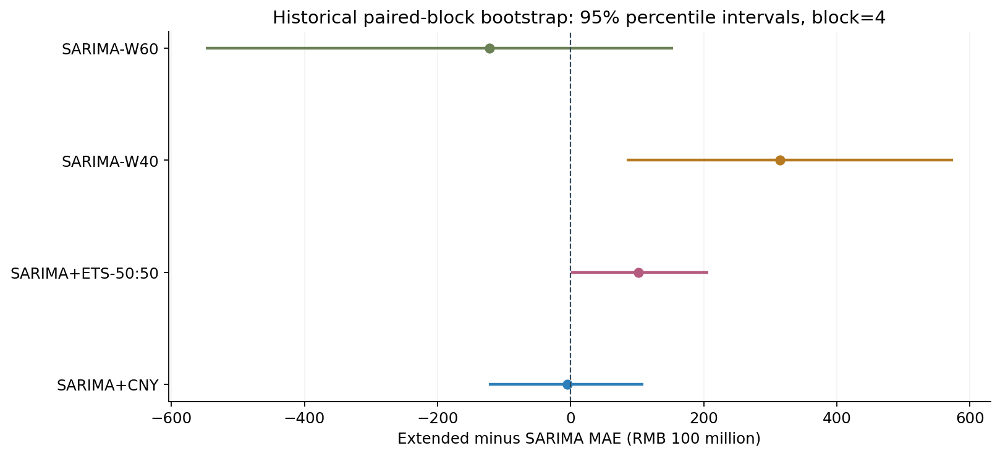
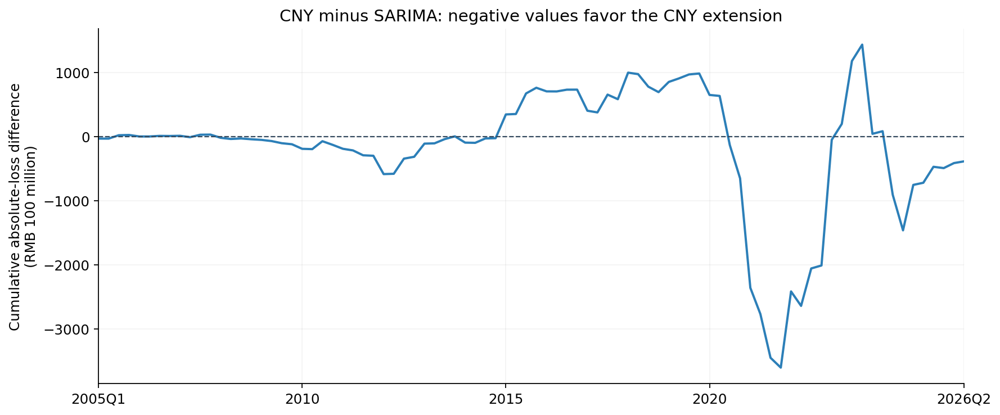
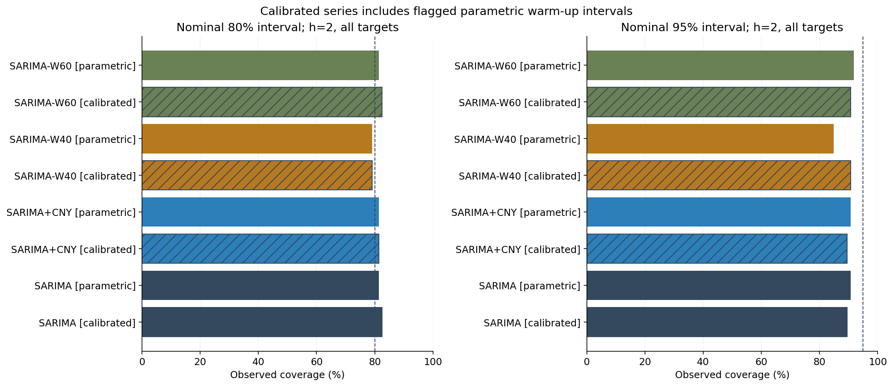

# STA4003 优化研究：第一轮实验报告

研究日期：2026-10-08；数据截至 2026Q2；原始 Stage 1–7 的预测、数据和报告保持不变。

## 已验证的研究状态

窗口拟合成功 174/174，失败 0。所有窗口模型已覆盖完整目标集。

在已完成的新增规格中，同时低于 SARIMA 的 h=2 全目标 MAE、RMSE、MASE 的规格：**SARIMA-W60**。这只是固定历史窗口的点估计比较，不能证明未来泛化；所有新增规格均保持探索性，原主模型不自动替换。

## 1. 点预测比较

主要评价为提前两个季度、2005Q1–2026Q2 的 86 个目标；MAE/RMSE 单位为亿元，MASE 无单位。所有模型使用同一个已归档的逐起点 MASE 分母。均值预测与中位数预测单独列示。

| model | n | MAE | RMSE | MASE |
| --- | --- | --- | --- | --- |
| ETS | 86 | 3,242.32 | 5,211.84 | 1.059760 |
| SARIMA | 86 | 2,970.24 | 5,115.52 | 0.947893 |
| SARIMA+CNY | 86 | 2,965.73 | 5,021.59 | 0.946407 |
| SARIMA+ETS-50:50 | 86 | 3,072.33 | 5,136.95 | 0.993093 |
| SARIMA-W40 | 86 | 3,285.01 | 5,454.58 | 1.041085 |
| SARIMA-W60 | 86 | 2,848.79 | 4,811.08 | 0.930755 |


40/60 季度实验保留每个起点原有的 Stage 4 阶数，仅改变训练长度；不足窗口长度时使用当时全部可用历史。因此检验的是固定已知阶数下的窗口效应，不是重新搜索模型阶数。等权组合为原尺度 SARIMA 与 ETS 的算术平均，不调权重。

60 季度窗口的主要 MAE 相对变化为 -4.09%，RMSE 为 -5.95%。但 MAE 差的主要历史 bootstrap 区间为 [-548.11, 154.19] 亿元；应作为后续验证候选，不应直接宣称获得稳定提升。分期表显示改善集中在哪些年份，而非假设短窗口普遍更好。

## 2. 配对损失与历史不确定性

下表差值均为扩展模型减 SARIMA，负数有利于扩展。使用配对循环区块 bootstrap，5,000 次、种子 20261008、主要区块长度 4；长度 8 的结果保存在 paired_bootstrap.csv。区块数的是保留后的观测：Q1 子样本的长度 4 对应四年。

| extended_model | metric | delta | lower_95 | upper_95 |
| --- | --- | --- | --- | --- |
| SARIMA+CNY | MAE | -4.506818 | -122.48 | 109.25 |
| SARIMA+CNY | RMSE | -93.93 | -283.14 | 141.19 |
| SARIMA+CNY | MASE | -0.001486 | -0.029914 | 0.025552 |
| SARIMA+ETS-50:50 | MAE | 102.09 | 0.361787 | 207.20 |
| SARIMA+ETS-50:50 | RMSE | 21.43 | -110.50 | 170.60 |
| SARIMA+ETS-50:50 | MASE | 0.045200 | 0.006747 | 0.087586 |
| SARIMA-W40 | MAE | 314.77 | 84.34 | 574.83 |
| SARIMA-W40 | RMSE | 339.06 | -16.58 | 765.96 |
| SARIMA-W40 | MASE | 0.093192 | 0.036127 | 0.154702 |
| SARIMA-W60 | MAE | -121.44 | -548.11 | 154.19 |
| SARIMA-W60 | RMSE | -304.45 | -947.98 | 115.09 |
| SARIMA-W60 | MASE | -0.017138 | -0.123162 | 0.054174 |





这些区间只描述已归档预测流程下的历史损失差，不重新拟合模型，不包含规格搜索的不确定性，也不是多重比较校正后的显著性结论。区间跨零既不证明有效，也不证明零效应。

## 3. 滚动预测区间与补充校准

参数区间从各起点保存的对数均值与方差计算；上下界不加半方差的均值修正。覆盖率、宽度和 Winkler 分数共同评价，Winkler 越低越好。

| model | coverage | method | subset | n | empirical_coverage | mean_width | winkler_score |
| --- | --- | --- | --- | --- | --- | --- | --- |
| SARIMA | 0.800000 | calibrated | all | 86 | 0.825581 | 8,756.61 | 19,035.40 |
| SARIMA | 0.800000 | calibrated | calibrated_only | 65 | 0.861538 | 10,656.11 | 22,631.89 |
| SARIMA | 0.800000 | parametric | all | 86 | 0.813953 | 9,427.34 | 16,958.16 |
| SARIMA | 0.950000 | calibrated | all | 86 | 0.895349 | 24,320.70 | 44,720.67 |
| SARIMA | 0.950000 | calibrated | calibrated_only | 65 | 0.907692 | 30,755.27 | 53,136.54 |
| SARIMA | 0.950000 | parametric | all | 86 | 0.906977 | 14,431.51 | 33,912.34 |
| SARIMA+CNY | 0.800000 | calibrated | all | 86 | 0.813953 | 8,591.08 | 18,456.69 |
| SARIMA+CNY | 0.800000 | calibrated | calibrated_only | 65 | 0.846154 | 10,436.56 | 21,875.04 |
| SARIMA+CNY | 0.800000 | parametric | all | 86 | 0.813953 | 9,407.22 | 16,566.04 |
| SARIMA+CNY | 0.950000 | calibrated | all | 86 | 0.895349 | 23,172.94 | 42,329.65 |
| SARIMA+CNY | 0.950000 | calibrated | calibrated_only | 65 | 0.907692 | 29,235.86 | 49,967.45 |
| SARIMA+CNY | 0.950000 | parametric | all | 86 | 0.906977 | 14,400.63 | 32,212.67 |
| SARIMA-W40 | 0.800000 | calibrated | all | 86 | 0.790698 | 12,380.76 | 22,903.35 |
| SARIMA-W40 | 0.800000 | calibrated | calibrated_only | 65 | 0.830769 | 15,443.10 | 27,665.16 |
| SARIMA-W40 | 0.800000 | parametric | all | 86 | 0.790698 | 9,335.04 | 19,031.44 |
| SARIMA-W40 | 0.950000 | calibrated | all | 86 | 0.906977 | 35,025.57 | 51,769.15 |
| SARIMA-W40 | 0.950000 | calibrated | calibrated_only | 65 | 0.938462 | 44,906.26 | 62,306.15 |
| SARIMA-W40 | 0.950000 | parametric | all | 86 | 0.848837 | 14,293.43 | 40,830.46 |
| SARIMA-W60 | 0.800000 | calibrated | all | 86 | 0.825581 | 8,996.33 | 17,541.80 |
| SARIMA-W60 | 0.800000 | calibrated | calibrated_only | 65 | 0.861538 | 10,983.92 | 20,668.72 |
| SARIMA-W60 | 0.800000 | parametric | all | 86 | 0.813953 | 9,705.70 | 16,182.45 |
| SARIMA-W60 | 0.950000 | calibrated | all | 86 | 0.906977 | 22,382.99 | 38,549.78 |
| SARIMA-W60 | 0.950000 | calibrated | calibrated_only | 65 | 0.923077 | 28,207.84 | 44,988.57 |
| SARIMA-W60 | 0.950000 | parametric | all | 86 | 0.918605 | 14,858.61 | 29,301.03 |



补充校准只使用该模型、该预测步长在当前起点之前已经兑现的误差（目标季度 ≤ 当前起点），最多最近 40 个，至少 20 个。使用绝对标准化对数误差的经验分位数（higher）。不足 20 个时回退到参数区间，并逐行标记；all 是含启动期回退的全目标结果，calibrated_only 仅统计实际校准行，二者样本不同，不能据此直接归因。此方法不保证未来覆盖率。

原 SARIMA 的名义 95% 区间实际覆盖率为 90.70%，补充校准全目标覆盖率为 89.53%；Winkler 分数分别为 33,912.34 和 44,720.67。覆盖率与区间代价必须一起解读，不能仅凭区间变宽就认定校准改善。

## 4. 中位数敏感性

| model | n | MAE | RMSE | MASE |
| --- | --- | --- | --- | --- |
| SARIMA | 86 | 2,947.88 | 5,100.11 | 0.941726 |
| SARIMA+CNY | 86 | 2,939.08 | 5,005.45 | 0.939412 |
| SARIMA-W40 | 86 | 3,256.97 | 5,443.34 | 1.033293 |
| SARIMA-W60 | 86 | 2,817.89 | 4,789.71 | 0.922126 |

中位数 exp(mu) 与条件均值 exp(mu+v/2) 是不同预测目标；MAE 下的中位数表现用于补充解释，不重写原条件均值结果。组合未提供中位数或区间。

## 5. 分时期稳定性

| model | period | n | MAE | RMSE | MASE |
| --- | --- | --- | --- | --- | --- |
| ETS | 2005-2011 | 28 | 1,711.09 | 2,041.09 | 1.173189 |
| SARIMA | 2005-2011 | 28 | 1,303.60 | 1,809.10 | 0.948569 |
| SARIMA+CNY | 2005-2011 | 28 | 1,292.87 | 1,804.61 | 0.942840 |
| SARIMA+ETS-50:50 | 2005-2011 | 28 | 1,505.09 | 1,877.78 | 1.058572 |
| SARIMA-W40 | 2005-2011 | 28 | 1,419.55 | 1,876.99 | 1.014181 |
| SARIMA-W60 | 2005-2011 | 28 | 1,388.35 | 1,858.46 | 0.992889 |
| ETS | 2012-2019 | 32 | 1,626.47 | 2,093.64 | 0.493810 |
| SARIMA | 2012-2019 | 32 | 1,397.81 | 2,101.25 | 0.421921 |
| SARIMA+CNY | 2012-2019 | 32 | 1,437.90 | 2,125.39 | 0.434530 |
| SARIMA+ETS-50:50 | 2012-2019 | 32 | 1,429.99 | 2,038.23 | 0.432629 |
| SARIMA-W40 | 2012-2019 | 32 | 1,647.54 | 2,198.11 | 0.500029 |
| SARIMA-W60 | 2012-2019 | 32 | 1,648.88 | 2,407.03 | 0.493220 |
| ETS | 2020-2026 | 26 | 6,880.08 | 8,942.39 | 1.634159 |
| SARIMA | 2020-2026 | 26 | 6,700.38 | 8,809.02 | 1.594515 |
| SARIMA+CNY | 2020-2026 | 26 | 6,647.67 | 8,622.14 | 1.580251 |
| SARIMA+ETS-50:50 | 2020-2026 | 26 | 6,781.46 | 8,852.91 | 1.612380 |
| SARIMA-W40 | 2020-2026 | 26 | 7,309.30 | 9,416.54 | 1.735972 |
| SARIMA-W60 | 2020-2026 | 26 | 5,898.41 | 8,106.23 | 1.402346 |

时期为 2005–2011、2012–2019、2020–2026；分期在看过基线后定义，只是描述性补充，不用于选择训练窗口或替代全目标主要评价。

### 原有两个冲击季度的补充评分敏感性

仅从评分目标中剔除原 Stage 6B 已预设的 2020Q1 和 2022Q2；不删除训练数据、不重新拟合，也不替换 86 个目标的主要评价。这项补充评分在观察首轮结果后加入，未选择新的冲击日期。

| model | n | MAE | RMSE | MASE |
| --- | --- | --- | --- | --- |
| ETS | 84 | 2,926.03 | 4,415.40 | 0.987205 |
| SARIMA | 84 | 2,634.72 | 4,218.66 | 0.869410 |
| SARIMA+CNY | 84 | 2,636.77 | 4,131.79 | 0.869515 |
| SARIMA+ETS-50:50 | 84 | 2,745.62 | 4,285.55 | 0.917319 |
| SARIMA-W40 | 84 | 2,950.64 | 4,639.24 | 0.963488 |
| SARIMA-W60 | 84 | 2,503.57 | 3,804.61 | 0.850223 |

## 6. 春节窗口与季度聚合

窗口 **[-14,+7]**：Q1 分配比例范围 1.000000–1.000000，有 1 个不同值；前一年 Q4 有 1 个不同值。Q1 变量没有年际变化，中心化后不能识别额外的日期效应。

窗口 **[-30,+7]**：Q1 分配比例范围 0.763158–1.000000，有 8 个不同值；前一年 Q4 有 8 个不同值。存在跨季度分配变化，但本轮没有拟合或验证其预测价值。

这是对预设日历窗口的机械分配检查；不能据此证明实际消费影响持续多少天，也不能证明春节没有经济效应。没有填补或拆分 2012 年后的一二月联合数据。

## 7. 数值与证据限制

所有历史结果都使用当前归档的数据版本，未重建历史发布版本与发布滞后，属于伪实时比较。新规格是在观察既有成绩后提出的；本轮未使用一个新的、未查看的外部测试集。需要后续未查看季度或另行设计的独立验证才能支持主模型替换。

原 Stage 7 跨环境重拟合产生细小数值差异；因此确定性测试现在在临时目录比较两次本机运行，并检查原归档未变。明确的逐文件换行规则保留已有归档清单记录的混合 LF/CRLF。

拟合失败不会被其他模型预测替代；详见 window_fits.csv、window_execution.json 和 checkpoints/。本轮没有改变原订单选择、春节定义、PMI 规格或最终预测。

## 8. 复现与来源

完整协议见 [optimization_protocol.md](../../../docs/optimization_protocol.md)。原始数值来自 outputs/forecasts 下的 SARIMA、SARIMA+CNY、ETS 归档，新窗口结果来自本目录 window_forecasts.csv；其余表格由 analysis.py 推导。

```powershell
python scripts/optimization/run_research.py
python scripts/optimization/run_research.py --analysis-only
python -m pytest -q
python -m compileall scripts tests
```

已有成功 checkpoint 可直接续用；失败 checkpoint 仅在显式 --retry-failed 时重试。运行版本和基线保留结果见 execution.json。

```json
{
  "python": "3.14.4 (tags/v3.14.4:23116f9, Apr  7 2026, 14:10:54) [MSC v.1944 64 bit (AMD64)]",
  "platform": "Windows-11-10.0.26200-SP0",
  "packages": {
    "numpy": "2.4.4",
    "pandas": "2.3.3",
    "scipy": "1.17.1",
    "statsmodels": "0.14.6",
    "matplotlib": "3.10.9"
  },
  "baseline_commit": "4b03bdc3b4602b4419478584b170da2e8b5dd927",
  "blas_threads": 1,
  "data_cutoff": "2026Q2",
  "evidence_status": "exploratory_historical_comparison"
}
```
